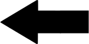
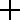

# Reaction Run
***
In the program you have to react as fast as possible when a combination of 5 black arrows and blanks appears on the screen and press the left arrow key if the central arrow points in the left direction else press the right arrow key. The maximum time for reaction is 2000ms.

In the times between the combinations first appears a plus sign in the screen centre.

 You have to be fixated on it so long you can see it. After the plus sign, zero to two stars could appear at the window, followed by the arrow-blank combination. The combination of the plus sign, the stars and the arrow-blank combination is called a trial.
 
 

## Exercise Run
In the trainings part you have only 12 trials. The smileys indicate, whether you pressed the right or wrong key. You can retry the exercise run so oft you want. The result isn't saved.

You pressed the right key:

You pressed the wrong key:

After you have played the 12 trials, you can rerun the exercise part, start the research part or quit the program.

## Research
The research part has two runs. A run consist of 96 trials. After every run you can take a break. In the end, all measured and calculated values are saved in a csv-file named after the test person (cipher) and the actuell date (also with seconds).
